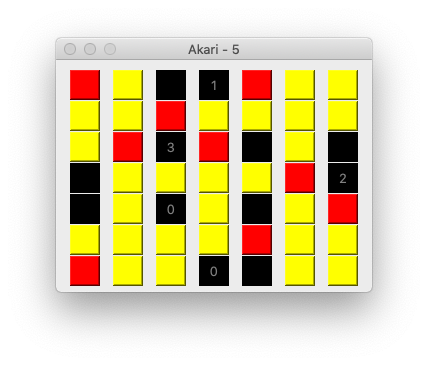

# akari-solver
A Desktop app that let's you play and solves Akari (Light Up) games

Below an example of a solved Akari game using this app: 

 

## Getting Started

This project is written in C++, so it works in all major OSes.

### Prerequisites

Install Qt Creator from [here](https://www.qt.io/download-qt-installer).

### Installing

To install, open the .pro project with Qt Creator and click on the green play button, then use the menu items to navigate and open a game in the games folder!

## Built With

* [Qt Creator](https://www.qt.io/) - The text editor used
* [GitHub Desktop](https://desktop.github.com/) - To manage developement

## Contributing

The following is a copy of PurpleBooth
> Please read [CONTRIBUTING.md](https://gist.github.com/PurpleBooth/b24679402957c63ec426) for details on our code of conduct, and the process for submitting pull requests to us.

## Versioning

<!-- We use [SemVer](http://semver.org/) for versioning. -->
For the versions available, see the [tags on this repository](https://github.com/cad0p/Money/tags). 

## Authors

* **Pier Carlo Cadoppi** - *Initial work*

See also the list of [contributors](https://github.com/cad0p/Money/contributors) who participated in this project.

## License

This project is licensed under the MIT License - see the [LICENSE.md](LICENSE.md) file for details

## Acknowledgments

* Hat tip to anyone whose code was used
*  * **Billie Thompson** - *README Template* - [PurpleBooth](https://github.com/PurpleBooth)
* Inspiration
* etc lol
